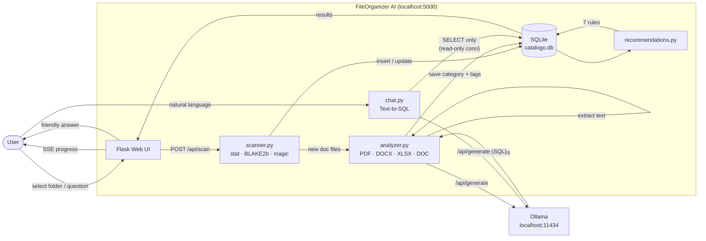

# FileOrganizer AI

[](https://www.python.org/)
[](LICENSE)
[](https://github.com/Raul1204-hub/fileorganizer-ai/actions/workflows/ci.yml)

A local Python application that scans a folder, classifies and analyzes files
using local AI (Ollama), stores metadata in SQLite, and exposes a professional
Flask web UI. Runs **100% offline** on Windows.

## Screenshots

> **To generate:** start the app with `python main.py`, browse to
> `http://localhost:5000`, take full-page screenshots and save them here.

| Dashboard | Chat IA |
|-----------|---------|
|  |  |

## Requirements

- Python 3.10+
- [Ollama](https://ollama.com) running locally with the required models:

```bash
ollama pull qwen3:8b            # document analysis + chat responses
ollama pull qwen2.5-coder:7b    # Text-to-SQL (natural language search)
```

## Setup

```bash
pip install -r requirements.txt
python main.py
```

Opens automatically at <http://localhost:5000>

## Optional features

### Image analysis (vision model)

FileOrganizer AI can describe images (JPG, JPEG, PNG, WEBP up to 15 MB) using a
local vision model. If the model is not installed the scan continues normally.

```bash
ollama pull moondream        # ~1.7 GB, lightweight default
# or a larger model:
ollama pull llava:7b
```

Override the model via environment variable:

```
FORG_VISION_MODEL=llava:7b python main.py
```

### OCR for scanned PDFs

PDFs that contain only scanned images (no machine-readable text layer) can be
processed with Tesseract OCR. Both runtime dependencies are optional — if
Tesseract is not found in PATH the scan continues without OCR.

**1. Install Tesseract on Windows**

Download the installer from
[UB Mannheim Tesseract](https://github.com/UB-Mannheim/tesseract/wiki)
(choose the latest 64-bit `.exe`). During setup, enable the
**Spanish** and **English** language packs.

Add Tesseract to your PATH (default install location):

```
C:\Program Files\Tesseract-OCR
```

Verify:

```bash
tesseract --version
```

**2. Install Python bindings (already in requirements.txt)**

```bash
pip install pytesseract pypdfium2
```

Override OCR languages (default `spa+eng`):

```
FORG_OCR_LANGUAGES=eng python main.py
```

## Features

- Recursive file scan with extension-based classification
- AI-powered document analysis (PDF, DOCX, DOC, TXT, XLSX, CSV) via Ollama
- Image analysis (JPG, JPEG, PNG, WEBP) via a local vision model — optional
- OCR fallback for scanned PDFs with no machine-readable text — optional
- Incremental scan — only re-processes new or modified files
- Duplicate detection via selective BLAKE2b hashing
- 7 automated recommendation rules
- Natural language file search via Text-to-SQL chat (read-only, authorizer-enforced)
- Real-time scan progress with ETA (Server-Sent Events)
- Full backup and undo system for all file operations
- Structured logging with rotating log files (`logs/fileorganizer.log`)
- Professional dark-mode web UI

## Architecture



## Configuration

All settings can be overridden with environment variables (prefix `FORG_`):

| Variable | Default | Description |
|---|---|---|
| `FORG_OLLAMA_BASE` | `http://localhost:11434/api` | Ollama API base URL |
| `FORG_OLLAMA_TIMEOUT` | `180` | Request timeout in seconds |
| `FORG_ANALYSIS_MODEL` | `qwen3:8b` | Model for document analysis |
| `FORG_SQL_MODEL` | `qwen2.5-coder:7b` | Model for Text-to-SQL |
| `FORG_RESPONSE_MODEL` | `qwen3:8b` | Model for chat answers |
| `FORG_DB_PATH` | `data/catalogo.db` | SQLite database path |

Example — use a larger model for better analysis:

```bash
FORG_ANALYSIS_MODEL=qwen3:30b python main.py
```

## CLI usage

```bash
python main.py              # start web UI (default)
python main.py scan PATH    # incremental scan from CLI
```

## Development

```bash
pip install -r requirements.txt ruff pytest
ruff check .                # lint
ruff format .               # auto-format
pytest tests/ -v            # run tests (Ollama-dependent tests auto-skip)
```

## License

MIT — see [LICENSE](LICENSE).
